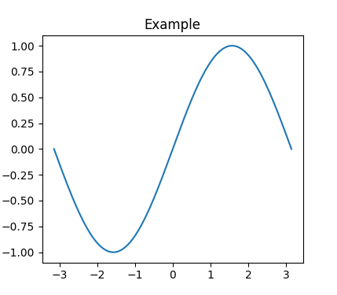
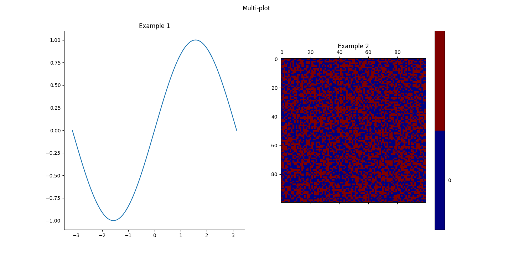

# Plotter

## Generate this README
- in html: `make html-readme` then open `README.html` in web browser, `firefox README.html` for instance.
- in pdf: `make pdf-readme`

## Description
Plotter is a plotting library based on `matplotlib`. It intends to simplify the plotting of data in Python by creating a descriptive approach for plots. The plots can be static or dynamic.

## Source code location
[https://github.com/T-TROUCHKINE/plotter](https://github.com/T-TROUCHKINE/plotter)

## Prerequisities
### Linux packages
- tk :
  - ArchLinux : `pacman -S tk`
  - Debian : `apt install tk`

### Python modules
- matplotlib : `pip install matplotlib`
- tikzplotlib : `pip install tikzplotlib`
- numpy : `pip install numpy`

**GTK3**  
For using GTK3 modules: see PyGObject documentation:
[https://pygobject.readthedocs.io/en/latest/index.html](https://pygobject.readthedocs.io/en/latest/index.html)

## Installation
### From PIP
`pip install plotter`

### From source
`python3 setup.py install`

## Examples
### Simplest example:
The code:
```python
import numpy as np
from plotter import Plotter

x = np.linspace(-np.pi, np.pi, 201)

to_plot = [{
    "title": "Example",
    "type": "plot",
    "data": [x, np.sin(x)]
}]

pl = Plotter(to_plot)
pl.show()
```
Gives:



### Multi-plot:
The code:
```python
import numpy as np
from plotter import Plotter

x = np.linspace(-np.pi, np.pi, 201)

to_plot = [{
    "title": "Example 1",
    "type": "plot",
    "data": [x, np.sin(x)]
},
{
    "title": "Example 2",
    "type": "matrix",
    "data": np.random.random((100,100))
}]

pl = Plotter(to_plot, figsuptitle="Multi-plot")
pl.show()
```
Gives:



## Documentation
Online documentation at [https://plotter-doc.xyz](https://plotter-doc.xyz)

### Build documentation locally

#### Requirements
- jekyll ([https://jekyllrb.com/](https://jekyllrb.com/))
- bundler ([https://bundler.io/](https://bundler.io/))

#### Command
```sh
cd doc
bundle exec jekyll build
```

Then the documentation is accessible in the `doc/_site/` directory. Usable using
a web browser for instance: `firefox doc/_site/index.html`
